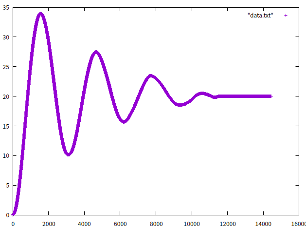
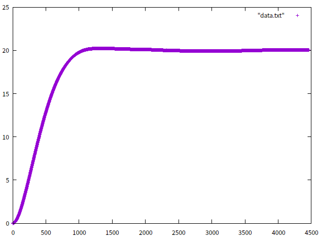
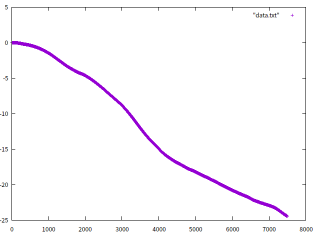

# 控制及模拟器题目

## 需要学习的内容
- 四旋翼的动力学建模
- 四旋翼的姿态控制和定高定点控制
- 位置式PID算法，串级PID算法，增项PID算法
- 仿真平台的设计

## 题目要求
- 此题较为开放，可以有充满想象力的设计，题目中的需求只是基本需求，可以完全开放且自主设计
- 自行设计一个四旋翼仿真平台，能够实现四旋翼无人机的动力学建模仿真和物理建模。
  - 四旋翼飞机是一个6自由度的机器人，包括x,y,z,roll,pitch,yaw,仿真要求能够结算出上述参数
  - 输入量为四旋翼飞机的四个电机油门量，输出为一个飞机的6自由度参数值
  - 要求模拟频率大于100Hz
  - 能够模拟有风环境
  - 能够模拟低气压环境
- 能够将飞机姿态结果实时展示成一个三维图像
  - 这里可以用任何语言完成，包括但是不限于python,matlab,c++,c
  - 三维图像必须是人能读懂的
- 完成姿态控制器的设计及实现
  - 稳定性: 飞机在三维图像显示中不应该有明显的抖动情况
  - 响应速度: 飞机到达预设倾斜角的相应时间小于1s(期望角度为0°-20°)
  - 鲁棒性: 在低气压和有风环境下能够仍然满足上述要求
- 完成定高定点控制器的设计及实现
  - 定高超调量小于5%,从起飞到升高到1.5m的响应速度小于2s
  - 定点悬停超调量小于5%

## 解题思路
- 此题需要有想象力，较强的信息搜集能力，阅读能力，还有学习能力，因为大部分的东西在此之前是没有听过的
- 大概要经历一下几个步骤
  - 四旋翼物理模型的建立
    - CSDN上有一篇很难懂的博客可以看一下[反正也看不懂(中文)](https://blog.csdn.net/u013859301/article/details/51284371)，[原文链接(英文)](http://andrew.gibiansky.com/blog/physics/quadcopter-dynamics/)
    - bilibili同样是个学习的地方[matlab仿真四旋翼](https://www.bilibili.com/video/av54969380)
  - 模型的三维显示
    - 推荐使用matlab，当然python也很方便，但是c++会很麻烦，如果核心代码使用c++编写，这里还需要使用通信协议和上述两种语言通信
  - 四旋翼控制器的设计和编写
    - 这里主要学习的就是PID算法和调参
    - [PID算法讲解](https://www.bilibili.com/video/av54996311)
    - 四旋翼PID算法网上一搜一大堆
  - 测试和调参
    - PID算法的[调参也是一个不简单的问题](https://www.cnblogs.com/clnchanpin/p/6939455.html)
- 上述过程仅供参考

## 样例
- 为了测试难度，此题考核人员预先实现了一遍，证实是可以完成的
- 测试过程中的参数调整，pitch期望值为20°时，pitch-时间曲线，证明控制器生效
  - 
  - 
- 无控制器时
  - 

## 评分标准
|功能|分数|
|--|--|
|物理仿真，四旋翼的运动学解算|100|
|三维实时显示|50|
|姿态环控制器的设计及调试，并且在上述环境下仿真显示成功|100|
|定高控制器设计及实现|50|
|定点控制器的设计及实现|50|
|有清晰的项目目录，使用说明，良好的编码规范|50|
|其他，开放模式，需要在文档里说明做了哪些部分|50|

## 文档结构
```c++
|--project_name
    |--src
        |--xx.cpp
    |--include
        |--xx.h
    |--bin
        |--xx
    |--test
        |--xx_test.cpp
    |--other
        |--?
    |--CMakeLists.txt
    |--README.md
```
上述文档结构不定，但是需要目录清晰有条理，如果为其他语言的实现方式需要注明环境(linux/win)，编程语言(c++/matlab/py)
