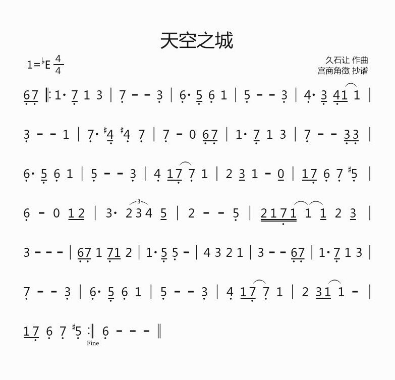

# 嵌入式与控制方向

**选择此题目需要自己提前准备材料，包括单片机 (Arduino / 51单片机 / STM32核心板)、蜂鸣器、OLED 显示屏、点阵、USB-TTL 转接模块、其它电子元件等。本题除了需要上交代码外，还需要现场评测。** 
  
## Content
  
- 学习单片机的原理与应用。
    - 建议没有单片机基础的同学学习 Arduino，比较容易入门。
    - 参考资源：[Arduino中文社区](https://www.arduino.cn/)、[《手把手教你学51单片机》电子书](https://pan.baidu.com/s/1c0zkWIc)、[STM32官方参考手册和数据手册](https://www.stmcu.com.cn/Designresource/design_list/cat_code/document/pro_cat/STM32/is_first/1)、[正点原子的《STM32开发指南》电子书](http://www.stmcu.org/module/forum/forum.php?mod=viewthread&tid=615919)、bilibili 上的入门教程。
- 学习 Arduino / 51 / STM32 基础编程，安装 Arduino IDE / Keil5。（可在 Windows 上玩）
- 掌握单片机系统架构，学习 GPIO、中断、定时器、PWM、串口通信、ADC、I2C 通信、SPI 通信的原理与应用。（如果对单片机还不熟悉，推荐按照这个顺序学习。）
- 学习使用外设，如 LED 灯、按键、点阵、数码管、蜂鸣器、OLED 显示屏等。学会查阅芯片数据手册。
- 学习 STM32 单片机的需要了解标准库。
  
## Project

### 基础部分

使用单片机（Arduino / 51 / STM32）结合蜂鸣器、OLED 显示屏、点阵、按键等电子元器件制作一个可交互的简易音乐播放器。基本要求如下：

- 使用 Arduino / 51 / STM32 作为主控单片机。
- 在单片机中存储至少十首音乐的乐谱，并可以通过蜂鸣器进行播放。
	- 存储音乐的简谱即可，例如下图中天空之城音乐的简谱，在单片机中可以存储为数组 `[6 7 1 7 1 3 ... 5 6]`，也可以用更形象的方式来存储音乐，请自行定义
	
	- 播放音乐旋律即可
	- 音乐应当具有一定的清晰度和辨识度
- 使用 OLED 显示屏制作一个简易交互界面，显示歌单、当前播放音乐、播放进度等信息。
- 使用按键或矩阵键盘，结合 OLED 显示界面完成交互功能设计，实现以下基本功能
	- 播放音乐
	- 暂停当前播放的音乐
	- 继续播放
	- 快进&快退
	- 播放下一首音乐
	- 其他功能
- 使用点阵或自主设计的 LED 阵列，显示当前播放音乐的动态频谱。
	- 频谱应当具有实时性，能够表现出当前的音调变化
	- 可以自行设计 LED 阵列，形状和大小不限
	- 如果使用点阵实现，不能使用驱动芯片
- 使用电脑作为上位机与单片机进行串口通信，编写上位机程序，查看音乐播放器中已存储的音乐。
	- 上位机程序可以使用任何语言进行编写，包括但不限于 C++、Java、python 等
	- 除了串口通信，也可以使用其他通信方式实现
- 给上位机程序添加下载音乐功能，即可以将更多的乐谱存入音乐播放器中。

### 发挥部分

使用单片机（Arduino / 51 / STM32）实现大数的相加和相乘。具体要求如下：

- 使用 Arduino / 51 / STM32 作为主控单片机。
- 将两个 10000 位以上的大数存储在内存卡中，单片机从内存卡中读取两个大数，相加之后把结果存储回内存卡中。
- 将两个 10000 位以上的大数存储在内存卡中，单片机从内存卡中读取两个大数，相乘之后把结果存储回内存卡中。

现场测评时，由空队提供内存卡，内存卡中有两个文本文件 `a.txt` 和 `b.txt`，分别存储了两个 10000 位以上的大数，单片机运算完后新建两个文件 `sum.txt` 和 `product.txt`，两个大数相加的结果存储在 `sum.txt` 中，相乘的结果存储在 `product.txt` 中。

## 评分标准

| 评分项             | 积分值 |
| ------------------ | ------ |
| 通过蜂鸣器播放音乐 | 50     |
| OLED交互界面       | 70     |
| 按键或矩阵键盘交互 | 40     |
| 显示音乐动态频谱   | 60     |
| 上位机通信         | 60     |
| 下载音乐           | 70     |
| 大数相加           | 70     |
| 大数相乘           | 80     |
