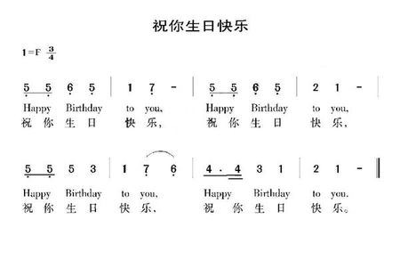

# MP3上位机

- Author: JiLi Liao
- Revised: JiLi Liao
- Date: 2019-11-2
- Version: 1.0.0
- Abstract: MP3上位机

## 依赖库
> pyserial

## 功能
使用前要更改程序中的串口序号  


1. 查看音乐播放器中已存储的音乐
```
$ python3 hostComputer.py  	# 运行
Enter 'exit' to exit, 'list' to get the list of music, 'download' to download music to MCU.
Please input command: list
-----------------MUSIC LIST---------------
1. song1
2. song2
3. song3
......

Please input command: exit
```


2. 下载音乐到单片机中
```
$ python3 hostComputer.py  	# 运行
Enter 'exit' to exit, 'list' to get the list of music, 'download' to download music to MCU.
Please input command: download
Please input the name of txt file: song1.txt
Downloading finished.
Please input command: exit
```

## 下载音乐所需的txt格式

音调转换：
- 低音1-7（数字下方带黑点）分别对应1-7
- 中音1-7分别对应8-14
- 高音1-7（数字上方带黑点）分别对应15-21  

节拍转换：
- 音调下方带两条下划线（即1/4节拍）对应 1
- 音调下方带一条下划线（即1/2节拍）对应 2
- 音调右边有•且下方有一条下划线 （即3/4节拍）对应 3
- 音调下方无下划线且右方无-或• （即1节拍）对应 4
- 音调右边有• （即1.5节拍）对应 6
- 音调右边有- （即2节拍）对应 8
- 音调右边有n个- （即n+1节拍）对应 4n+4   

txt文件格式：  
```
歌名（只支持英文，不能包含字符'^'和'*'）
*
音调（以逗号分割开，可以多行）
*
节拍（以逗号分割开，可以多行）
```

例如：  

   

转换得：
```
Happy birthday
*
5, 5, 6, 5, 8, 7,     5, 5, 6, 5, 9, 8,    
5, 5, 12, 10, 8, 7, 6,       11, 11, 10, 8, 9, 8
*
2, 2, 4, 4, 4, 8,         2, 2, 4, 4, 4, 8, 
2, 2, 4, 4, 4, 4, 4,      3, 1, 4, 4, 4, 8
```